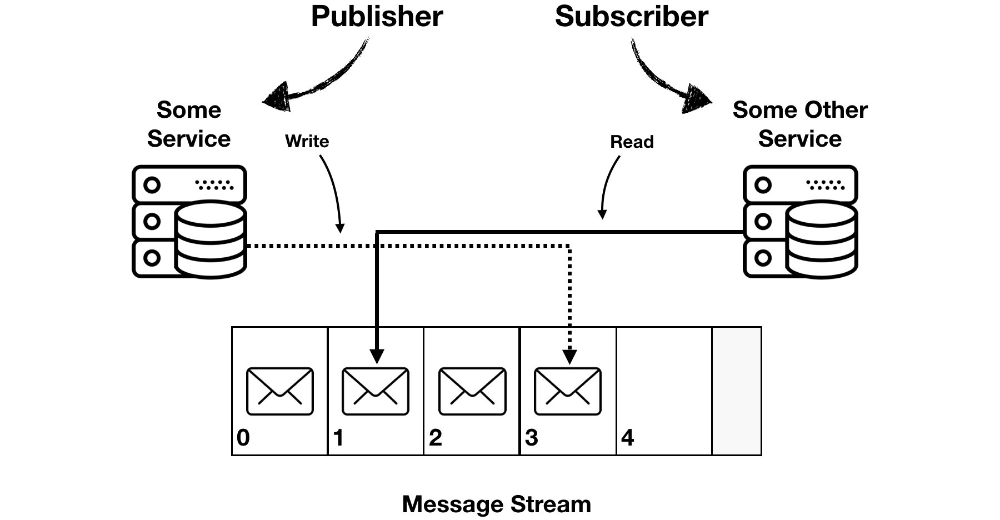

# Pub/Sub (Publish and Subscribe)

In a publish and subscribe system, events are written to a stream by one [endpoint](/glossary.md#endpoint) and can be reacted to by any number of other endpoints, or even by the endpoint that wrote the event.

## Loose Coupling

Pub/Sub pattern is a [messaging](./messages-and-messaging/messaging.md) pattern that enables a loose coupling of different parts of a system, allowing individual parts to be changed independently without concerns for other parts being affected by the change.

## Autonomous Services

Pub/Sub is the essential pattern that allows services to be autonomous. Without the level of decoupling provided by pub/sub, services cannot be taken offline independent of the services they interact with. An outage in one service would cause outages in the other services.

Without pub/sub, there is no possibility of autonomy. And without autonomy, the use of the term _service_ or _microservice_ to describe an architecture is largely a mistake. A service architecture without pub/sub is arguably not a service architecture, and is more appropriately called a _distributed monolith_.

## Message Contracts

As is the case with all messaging patterns, as long as the structure and content of the messages flowing between parts of a system do not change, individual parts are free to change without regard for other parts of the system. This is why is critical to pay significant attention to getting the message _schemas_ right so that they do not need to change later due to a need to correct oversights.

The schemas of the messages that are exchanged between parts of a system are the _contracts_ that each subsystem or service agree to respect. Any unplanned changes made to the messages schemas breaks the contract and obviates any expectation that the parts of the system will continue to function correctly.

## Event Sourcing

Because a system based on pub/sub provides ample opportunity to simplify application data storage by using [event sourcing](./event-sourcing.md). Because there is pub/sub, there is events. And once a system is based on events, event sourcing can be leveraged.

::: warning
Pub/sub only applies to events and event streams/categories. It's not a pattern that should be used for commands and command streams/categories.
:::
